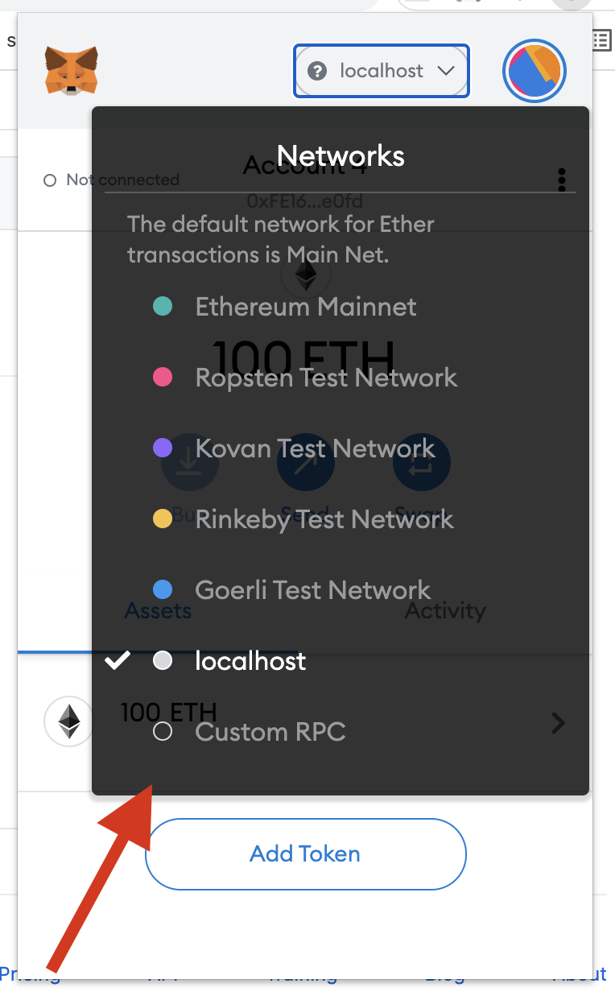
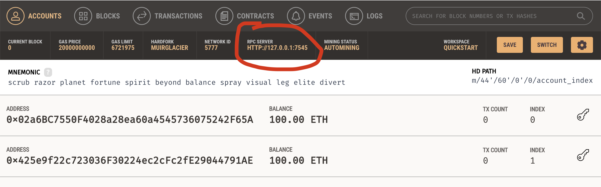
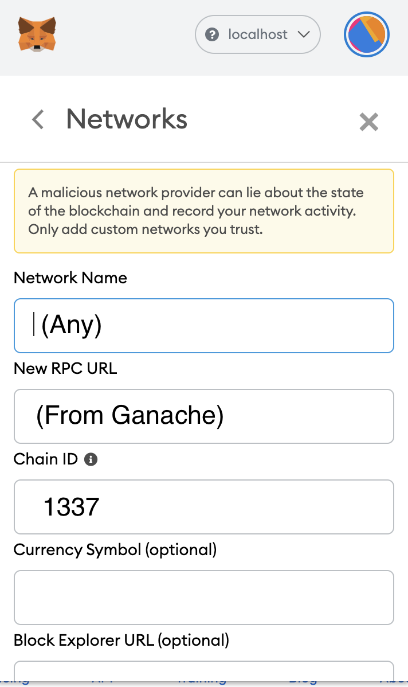
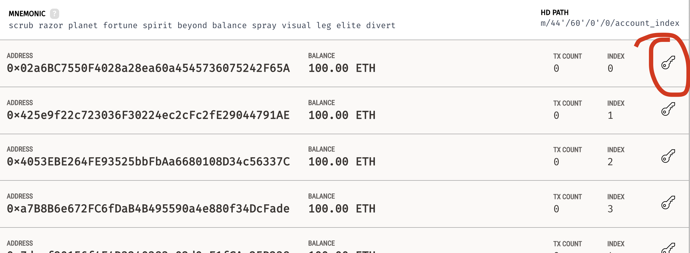
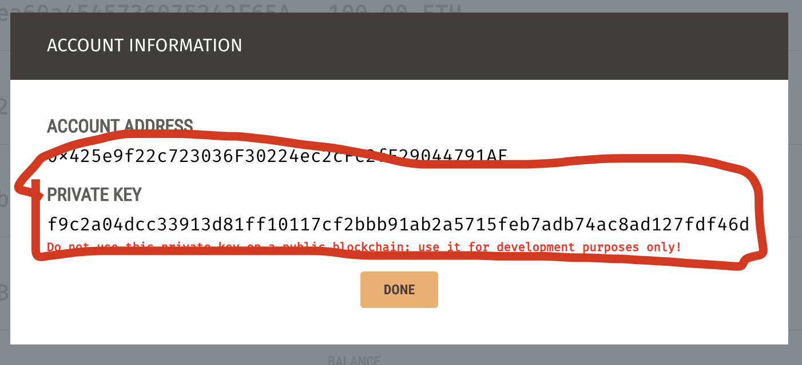
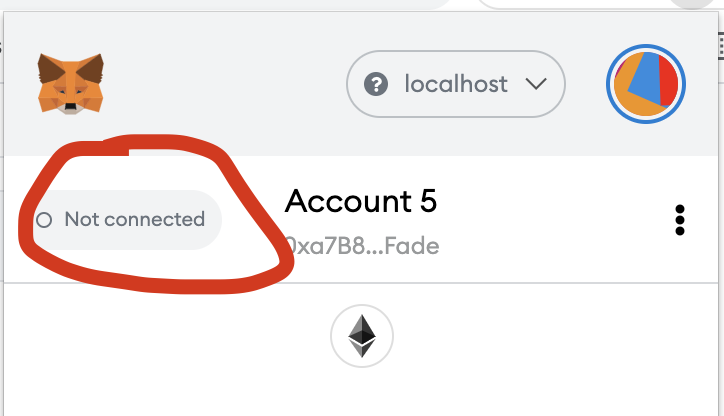
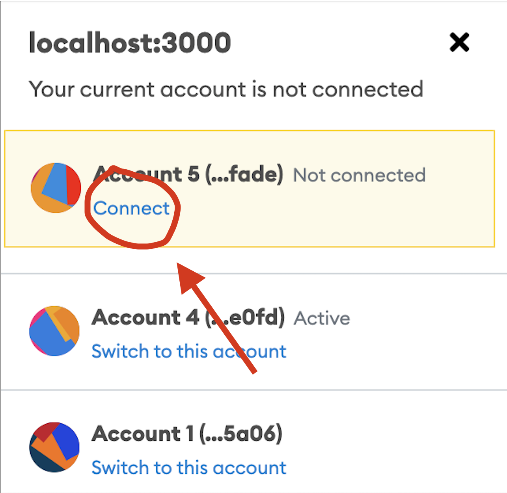

# Connect MetaMask to Ganache

Add new network to MetaMask
First, open the Networks tab and click on Custom RPC.

Then open Ganache and copy the URL. In our case, it is `HTTP://127.0.0.1:7545`

Put all information like in the screenshot.

Congratulations, you added your local network.
We need to add new accounts to Metamask to start work. To do this, you should add a private key to Metamask. Open Ganache and select not the first account's private key.

After this open Metamask and click to circle on top. It will open the account tab. Click to Import Account button.
Put Private key to the field.
After this, you have to connect to your network.

